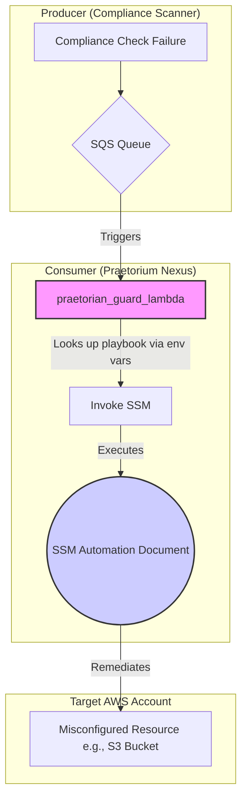

# Praetorium Nexus: Automated Enforcement & Remediation (AER) Engine

`Praetorium Nexus` is an automated enforcement and remediation engine designed to maintain continuous compliance within an AWS environment. It directly fulfills security mandates like **KSI-CNA-08** from the FedRAMP framework, which requires federal systems to use automated tools to enforce secure configurations.

The engine listens for compliance "drift" signals from monitoring systems and automatically executes G-as-Code playbooks to return cloud resources to their intended, secure state. It transforms compliance from a manual, reactive process into a proactive, automated, and auditable engineering discipline.

## Why Implement Praetorium Nexus?

In today's complex cloud environments, maintaining security and compliance is a significant operational burden. Praetorium Nexus provides a powerful solution to automate this process, delivering tangible business value.

*   **Reduce Compliance Costs:** Automate the manual, error-prone, and repetitive work of identifying and fixing common misconfigurations. This frees up valuable engineering time to focus on innovation rather than reactive fixes.
*   **Enhance Security Posture:** Instantly and consistently remediate security vulnerabilities, shrinking the window of exposure from hours or days to mere seconds. This proactive stance significantly reduces the risk of data breaches caused by misconfiguration.
*   **Achieve Continuous Compliance:** Move from stressful, point-in-time audits to a state of continuous, automated enforcement. The system works 24/7 to ensure your infrastructure adheres to your defined security policies.
*   **Streamline Audits:** Provide a clear, version-controlled, and immutable audit trail of all remediation actions. With GRC-as-Code, every playbook is documented, and every execution is logged, simplifying evidence gathering for auditors.

## Key Features

*   **GRC-as-Code Engine:** Define remediation actions as simple, version-controlled, and auditable YAML files (AWS SSM Automation Documents). This "control-to-code" mapping is transparent and easy for both engineers and auditors to understand.
*   **Least-Privilege Execution:** Each remediation playbook is executed with a dedicated, single-purpose IAM role that grants *only* the permissions required to fix a specific misconfiguration. This design minimizes the "blast radius" and adheres to the principle of least privilege.
*   **Extensible & Scalable Architecture:** The engine's core logic is decoupled from the playbooks. Adding a new remediation is as simple as adding a new playbook file and a corresponding IAM role module in Terraform—no changes to the core application code are needed.
*   **Cloud-Native & Serverless:** Built on AWS Lambda and SQS, the architecture is highly scalable, resilient, and cost-effective. You only pay for what you use, and the system can handle a high volume of events without manual intervention.

## Architecture & Workflow

The AER Engine operates on a simple, event-driven, and serverless architecture.

1.  **Receive:** An SQS Queue receives a JSON payload from a compliance scanner (like `KSI_Engine`) when a check *fails*.
2.  **Triage:** The SQS message triggers the `praetorian_guard_lambda`.
3.  **Discover:** The Lambda parses the failed `control_id` (e.g., `NIST-800-53-CM-6`) and looks up the corresponding playbook prefix (e.g., `CM6_S3`) in its internal map.
4.  **Execute:** It then finds the full SSM Document name and the dedicated IAM Role ARN from its environment variables (e.g., `CM6_S3_DOCUMENT_NAME` and `CM6_S3_EXECUTION_ROLE_ARN`).
5.  **Enforce:** The Lambda triggers the SSM Automation Document, passing the target resource ID and the dedicated, least-privilege IAM role to the playbook.
6.  **Audit:** The playbook executes to fix the misconfiguration. All actions are logged in CloudTrail and SSM Automation history for a complete audit trail.



## GRC-as-Code Playbook Directory

All remediation playbooks are organized by their corresponding NIST 800-53 control family, providing a "control-to-code" mapping that is auditable and version-controlled.

```
/remediation_playbooks
├── AC_Access_Control/
├── CM_Configuration_Management/
│   ├── README.md
│   └── cm-6_s3_public_access_fix.yml
...
```

## Deployment

This engine is deployed via Terraform and uses a modular design for scalability.

1.  Navigate to the `/terraform` directory.
2.  Create a `terraform.tfvars` file to provide values for the required inputs (see `variables.tf`).
3.  Run `terraform init`, `terraform plan`, and `terraform apply`.
4.  **To add a new playbook:**
    *   Add the SSM Document YAML file to the `remediation_playbooks` directory.
    *   Add a new `module "..."` block in `main.tf` to create the dedicated IAM role for the playbook.
    *   Add the new environment variables for the `DOCUMENT_NAME` and `EXECUTION_ROLE_ARN` to the `aws_lambda_function` resource.
    *   Update the `CONTROL_ID_TO_PLAYBOOK_PREFIX_MAP` in `lambda_function.py`.

## Local Development and Testing

The core logic resides in the `praetorian_guard_lambda`. To test changes locally, you can use a tool like the AWS SAM CLI to invoke the Lambda function with a sample SQS event payload.

### 1. Create a Sample Event

Create a file named `events/cm-6_failure.json` with the following content:

```json
{
  "Records": [
    {
      "messageId": "19dd0b57-b21e-4ac1-bd88-01bbb068cb78",
      "receiptHandle": "MessageReceiptHandle",
      "body": "{\n  \"control_id\": \"NIST-800-53-CM-6\",\n  \"target_id\": \"arn:aws:s3:::my-insecure-public-bucket\",\n  \"status\": \"FAIL\",\n  \"timestamp\": \"2025-10-23T14:00:00Z\"\n}",
      "attributes": {
        "ApproximateReceiveCount": "1",
        "SentTimestamp": "1523232000000",
        "SenderId": "AIDAISD5555555555555",
        "ApproximateFirstReceiveTimestamp": "1523232000001"
      },
      "messageAttributes": {},
      "md5OfBody": "7b270e59b47ff90a553787216d84d776",
      "eventSource": "aws:sqs",
      "eventSourceARN": "arn:aws:sqs:us-gov-west-1:123456789012:ksi-engine-failures",
      "awsRegion": "us-gov-west-1"
    }
  ]
}
```

### 2. Create an Environment Variables File

The refactored Lambda function uses environment variables to discover playbooks. Create a file named `env.json` with the variables needed for the test event:

```json
{
  "praetorian_guard_lambda": {
    "LOG_LEVEL": "INFO",
    "CM6_S3_EXECUTION_ROLE_ARN": "arn:aws:iam::123456789012:role/PraetoriumNexus-CM6-S3-Public-Access-Fix-Role",
    "CM6_S3_DOCUMENT_NAME": "PraetoriumNexus-CM-6-S3-Public-Access-Fix"
  }
}
```
*Note: The role ARN does not need to be valid for a local invocation, but it must be present.*

### 3. Invoke the Function Locally

You can now run the Lambda function locally:
```bash
# Make sure you are in the root directory of the project
sam local invoke praetorian_guard_lambda -e events/cm-6_failure.json --env-vars env.json
```

## Future Enhancements

Praetorium Nexus provides a strong foundation for a comprehensive cloud governance program. The following features are potential enhancements for future development:

*   **Enhanced Notifications:** Integrate with SNS to publish remediation results to ticketing systems (Jira, ServiceNow) or chat platforms (Slack, Teams) for improved visibility.
*   **Manual Approval Gates:** For highly sensitive operations, use AWS Step Functions to create workflows that require human approval before a remediation is automatically applied.
*   **Cross-Account Remediation:** Implement a pattern to deploy the engine in a central security account that can assume roles to perform remediation across an entire AWS Organization.
*   **"Dry Run" Mode:** Add the ability to run playbooks in a non-destructive "dry run" mode that reports the changes it *would* have made, building operator confidence and enabling safe testing.
